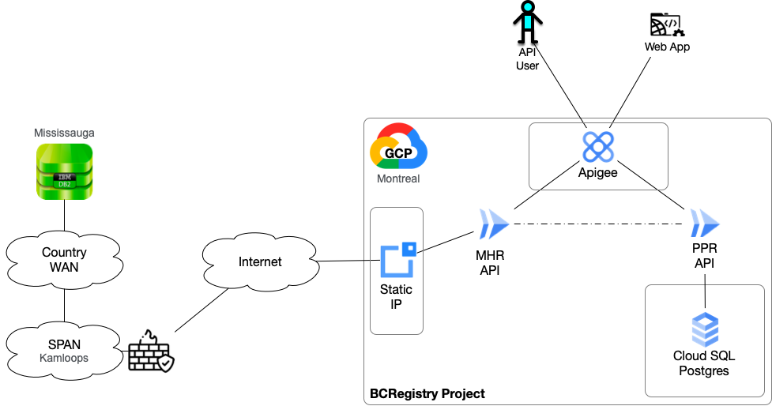
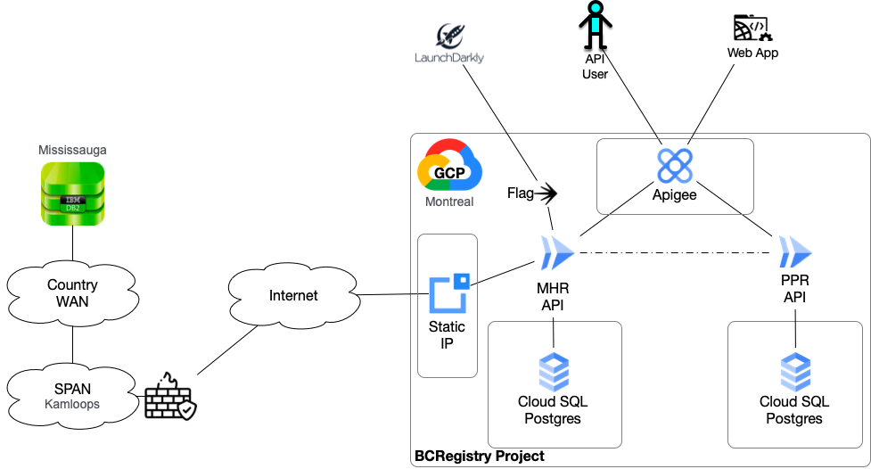
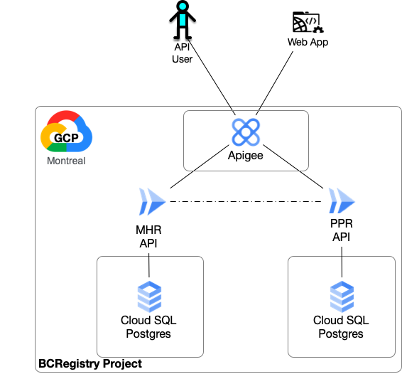

- Start Date: 2022-03-15
- Target Major Version: bcgov/entity#11049
- Reference Issues: bcgov/entity#10994
- Entity Issue: 
- Implementation PR: 

# Summary

PPR (Personal Property Registry) and MHR (Mobile Home Registry) are believed to have a lot in common, including users, application elements and features along with some joint workflows that require information from both. This is more heavily weighted on the MHR portion of the business. The intent is to release features in MHR to small user groups, (staff, Manufacturers etc...) and be able to have the feature run in parralell from in old and new appliciation. 

This paper and the associated User Experience designs are defining how these two application can be combined to leverage application assets and enhance their overall usability.

# Motivation

MHR uses and display data held in PPR, the user base uses both applications, and there are many similarities to the application flow, presentation and use.

# Detailed design
## API and Datastore

The modernized MHR will be delivered in phases and run in parallel to the existing system using the same IBM DB2 database hosted on the shared BC Gov Mainframe.

The inital builds will determine if the latency in accessing the database will be an issue that requires the API to:
- be hosted in a different location,
- different network topology, or
- complete the database migration before general availability.

The initial implementation is expected to be deployed as shown in the following diagram.

Once MHR is feature complete, a Feature Flag will be implmented to manage the use of a local, parallel database. After all the data is migrated and the system has proven the local databases' correctness, the flag will turn off access to the legacy DB2 database

The final configuration after cleaning up the flags and legacy connections, it will be running in its final state, as shown below.

## Web Application
The UI/UX designs leverage the existing PPR application significantly.

The search screens will remain separate as the two systems cannot be combined without extensive and expensive sorting in the middle tier (API layer).

# Drawbacks

The latency between the API services and the DB2 Database will be an issue.
The API layer will need to minimze calls to the database, which may require creating new views or stored procedures to minimize calls to the database. This is not an optimal design to do either of these things.

# Alternatives

- The MHR API could be placed in OCP, which would reduce some level of latency due to the dedicated networks between SPAN and the Mainframe.
- A network route between Mississauga and Montreal could be enbaled. This could significantly reduce latency.
- The system could be migrated to the final configuration before going fully live and operational for all users communities

# Unresolved questions

Optional, but suggested for first drafts. What parts of the design are still TBD?

# Thanks

This template is heavily based on the Vue, Golang, React, and other RFC templates. Thanks to those groups for allowing us to stand on their shoulders.
